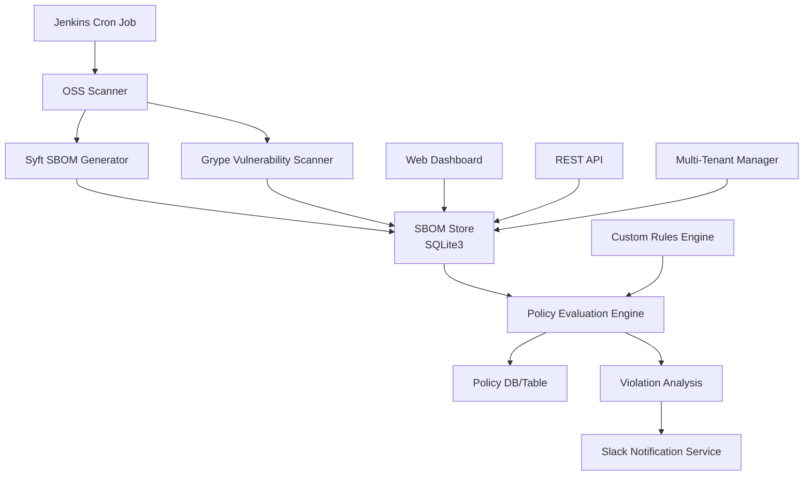

# OSS Compliance Scanner

모노레포/MSA 환경에서 각 모듈의 오픈소스 라이브러리 의존성을 스캔하여 취약점과 라이선스 위반을 탐지하고 Slack으로 알림을 전송하는 종합적인 OSS 컴플라이언스 도구입니다.

## 🏗️ 아키텍처



## ✨ 주요 기능

### 🔍 **OSS 스캔 및 분석**
- **SBOM 생성**: Syft를 이용한 Software Bill of Materials 자동 생성
- **취약점 스캔**: Grype를 이용한 실시간 취약점 탐지
- **라이선스 분석**: 다양한 라이선스 정책 준수 검사
- **멀티 언어 지원**: Node.js, Go, Python, Java, Rust, PHP, Ruby 등

### 🌐 **웹 대시보드 & API**
- **실시간 대시보드**: Bootstrap 기반 모던 UI
- **REST API**: 완전한 RESTful API 제공
- **데이터 시각화**: 차트와 통계를 통한 직관적 분석
- **SBOM 관리**: 웹 인터페이스를 통한 SBOM 조회 및 관리

### 🔧 **정책 관리**
- **커스텀 룰 엔진**: YAML 기반 유연한 정책 설정
- **라이선스 정책**: GPL 차단, MIT/Apache 허용 등 세밀한 제어
- **취약점 정책**: CVSS 점수 기반 차단/경고 정책
- **유예 기간**: 취약점 수정을 위한 유예 기간 설정

### 📊 **멀티 테넌트 & 조직 관리**
- **조직별 분리**: 테넌트별 독립적인 정책 및 데이터 관리
- **역할 기반 접근**: admin, viewer, scanner 역할 지원
- **리소스 할당**: 저장소/모듈별 테넌트 할당

### 🔔 **알림 및 통합**
- **Slack 통합**: 실시간 취약점 및 정책 위반 알림
- **CI/CD 통합**: GitHub Actions, GitLab CI 파이프라인 지원
- **웹훅 지원**: 외부 시스템 연동을 위한 웹훅

### 🏢 **엔터프라이즈 기능**
- **Jenkins 스케줄링**: 정기적인 자동 스캔
- **Docker/Kubernetes**: 컨테이너 환경 완전 지원
- **모니터링**: Prometheus/Grafana 메트릭 제공

## 🚀 빠른 시작

### 1. 사전 요구사항

- **Go 1.20+**
- **Syft** (SBOM 생성)
- **Grype** (취약점 스캔)
- **SQLite3** (기본 데이터베이스)

#### macOS 설치:
```bash
# Homebrew를 통한 도구 설치
brew install anchore/syft/syft
brew install anchore/grype/grype
brew install sqlite3
```

#### Linux 설치:
```bash
# Syft 설치
curl -sSfL https://raw.githubusercontent.com/anchore/syft/main/install.sh | sh -s -- -b /usr/local/bin

# Grype 설치
curl -sSfL https://raw.githubusercontent.com/anchore/grype/main/install.sh | sh -s -- -b /usr/local/bin
```

### 2. 설치 및 빌드

```bash
# 저장소 클론
git clone <repository-url>
cd oss-compliance-scanner

# Go 모듈 의존성 설치
go mod tidy

# 바이너리 빌드
go build -o oss-compliance-scanner .

# 실행 권한 부여
chmod +x oss-compliance-scanner
```

### 3. 설정 파일 생성

```bash
# 설정 파일 복사
cp .oss-compliance-scanner.yaml.sample .oss-compliance-scanner.yaml
cp custom-rules.yaml.sample custom-rules.yaml

# 필요에 따라 설정 수정
vi .oss-compliance-scanner.yaml
```

### 4. 데이터베이스 초기화

```bash
# SQLite 데이터베이스 스키마 생성
sqlite3 db/oss_scan.db < db/schema.sql
```

## 📖 사용 방법

### CLI 스캔

```bash
# 단일 저장소 스캔
./oss-compliance-scanner scan --repo /path/to/repository

# 특정 모듈 스캔
./oss-compliance-scanner scan --repo /path/to/repo --module frontend

# 여러 옵션 사용
./oss-compliance-scanner scan \
  --repo /path/to/repo \
  --module backend \
  --output json \
  --notify \
  --verbose
```

### 웹 대시보드 실행

```bash
# 웹 서버 시작 (기본 포트: 8080)
./oss-compliance-scanner server

# 커스텀 포트로 실행
./oss-compliance-scanner server --port 9090
```

접속: http://localhost:8080

### API 사용

```bash
# 헬스체크
curl http://localhost:8080/api/v1/health

# SBOM 목록 조회
curl http://localhost:8080/api/v1/sboms

# 취약점 목록 조회
curl http://localhost:8080/api/v1/vulnerabilities

# 정책 위반 조회
curl http://localhost:8080/api/v1/violations
```

## 🧪 테스트 환경

테스트를 위한 샘플 프로젝트들이 `test-projects/` 디렉토리에 준비되어 있습니다:

```bash
# 테스트 프로젝트로 이동
cd test-projects

# 자동화된 테스트 실행
./run-tests.sh
```

### 테스트 프로젝트 구조:
- **nodejs-app/**: Node.js 취약점 테스트용 (axios, lodash 등)
- **go-app/**: Go 취약점 테스트용 (JWT 라이브러리 등)
- **python-app/**: Python 취약점 테스트용 (Flask, PyJWT 등)
- **java-app/**: Java 취약점 테스트용 (Log4j 등)
- **multi-module/**: 멀티 모듈 프로젝트 테스트용

## ⚙️ 설정

### 기본 설정 (.oss-compliance-scanner.yaml)

```yaml
database:
  driver: sqlite3
  path: ./db/oss_scan.db

scanner:
  syft_path: syft
  grype_path: grype
  timeout: 300
  cache_enabled: true

policy:
  license:
    blocked_licenses: ["GPL-2.0", "GPL-3.0"]
    allowed_licenses: ["MIT", "Apache-2.0", "BSD-3-Clause"]
  vulnerability:
    fail_on_severity: "critical"
    warn_on_severity: "high"

notification:
  slack:
    enabled: true
    webhook_url: "https://hooks.slack.com/..."
    channel: "#security-alerts"
```

### 커스텀 룰 (custom-rules.yaml)

```yaml
rules:
  license_rules:
    - name: "Block GPL licenses"
      condition:
        field: "license"
        operator: "contains"
        value: "GPL"
      action: "block"
      
  vulnerability_rules:
    - name: "Critical CVEs"
      condition:
        field: "severity"
        operator: "equals"
        value: "Critical"
      action: "block"
```

## 🔄 CI/CD 통합

### GitHub Actions

```yaml
# .github/workflows/oss-compliance.yml에 포함됨
name: OSS Compliance Check
on: [push, pull_request, schedule]
jobs:
  oss-scan:
    runs-on: ubuntu-latest
    steps:
      - uses: actions/checkout@v3
      - name: OSS Compliance Scan
        run: |
          ./oss-compliance-scanner scan --repo .
```

### GitLab CI

```yaml
# .gitlab-ci.yml에 포함됨
oss_compliance:
  stage: scan
  script:
    - ./oss-compliance-scanner scan --repo .
  artifacts:
    reports:
      junit: oss-scan-results.xml
```

## 🏢 엔터프라이즈 배포

### Docker 배포

```bash
# Docker 이미지 빌드
cp Dockerfile.sample Dockerfile
docker build -t oss-compliance-scanner .

# Docker Compose 실행
cp docker-compose.yaml.sample docker-compose.yaml
docker-compose up -d
```

### Kubernetes 배포

```bash
# Kubernetes 매니페스트 적용
cp k8s.yaml.sample k8s.yaml
kubectl apply -f k8s.yaml
```

## 📊 주요 지원 언어 및 패키지 매니저

| 언어 | 패키지 매니저 | 지원 상태 |
|------|--------------|----------|
| Node.js | npm, yarn | ✅ 완전 지원 |
| Go | go mod | ✅ 완전 지원 |
| Python | pip, poetry | ✅ 완전 지원 |
| Java | Maven, Gradle | ✅ 완전 지원 |
| Rust | Cargo | ✅ 완전 지원 |
| PHP | Composer | ✅ 완전 지원 |
| Ruby | Bundler | ✅ 완전 지원 |
| .NET | NuGet | ✅ 완전 지원 |

## 🔧 고급 사용법

### 멀티 테넌트 설정

```bash
# 테넌트 생성
curl -X POST http://localhost:8080/api/v1/tenants \
  -H "Content-Type: application/json" \
  -d '{"name": "development-team", "description": "Development Team"}'

# 사용자 할당
curl -X POST http://localhost:8080/api/v1/tenants/dev-team/users \
  -H "Content-Type: application/json" \
  -d '{"email": "dev@company.com", "role": "admin"}'
```

### 정책 관리

```bash
# 라이선스 정책 추가
curl -X POST http://localhost:8080/api/v1/policies/license \
  -H "Content-Type: application/json" \
  -d '{"license": "GPL-3.0", "action": "block", "reason": "Copyleft license"}'

# 취약점 정책 설정
curl -X POST http://localhost:8080/api/v1/policies/vulnerability \
  -H "Content-Type: application/json" \
  -d '{"severity": "critical", "action": "fail", "grace_period_days": 7}'
```

## 📈 모니터링 및 메트릭

### Prometheus 메트릭

- `oss_scans_total`: 총 스캔 횟수
- `oss_vulnerabilities_found`: 발견된 취약점 수
- `oss_policy_violations`: 정책 위반 건수
- `oss_scan_duration_seconds`: 스캔 소요 시간

### 로그 관리

```bash
# 로그 레벨 설정
export OSS_SCANNER_LOG_LEVEL=debug

# 로그 파일 위치
tail -f logs/oss-compliance.log
```

## 🔒 보안 고려사항

- **인증**: API 키 기반 인증 지원
- **HTTPS**: TLS 인증서 설정 권장
- **데이터 암호화**: 민감한 설정 정보 암호화
- **접근 제어**: IP 화이트리스트 및 역할 기반 접근 제어

## 🤝 기여하기

1. Fork the Project
2. Create your Feature Branch (`git checkout -b feature/AmazingFeature`)
3. Commit your Changes (`git commit -m 'Add some AmazingFeature'`)
4. Push to the Branch (`git push origin feature/AmazingFeature`)
5. Open a Pull Request

## 📄 라이선스

이 프로젝트는 MIT 라이선스 하에 배포됩니다. 자세한 내용은 `LICENSE` 파일을 참조하세요.

## 🆘 지원 및 문의

- **이슈 리포트**: GitHub Issues를 통해 버그 신고
- **기능 요청**: GitHub Discussions에서 기능 제안
- **문서**: [위키 페이지](wiki-url) 참조
- **이메일**: support@company.com

## 🔄 업데이트 로드맵

### v1.1.0 (계획)
- [ ] 더 많은 언어 지원 (Swift, Kotlin)
- [ ] AI 기반 취약점 분석
- [ ] 성능 최적화

### v1.2.0 (계획)
- [ ] 클러스터 모드 지원
- [ ] 고급 리포팅 기능
- [ ] SSO 통합

---

**Made with ❤️ for Open Source Security**

