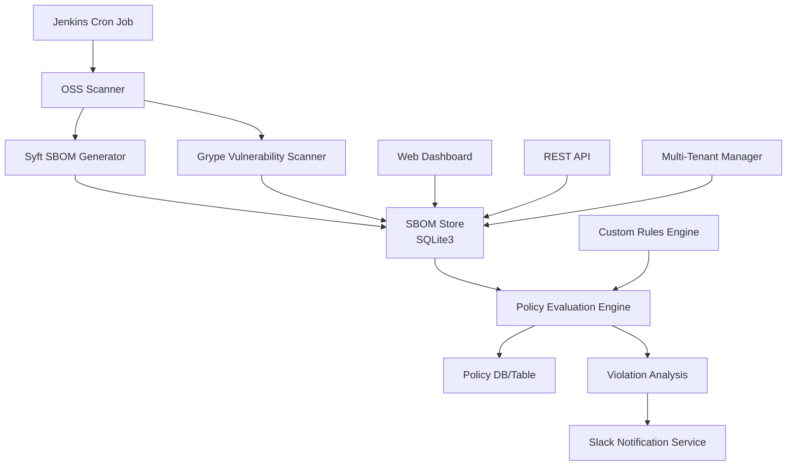

# OSS Compliance Scanner

모노레포/MSA 환경에서 각 모듈의 오픈소스 라이브러리 의존성을 스캔하여 취약점과 라이선스 위반을 탐지하고 Slack으로 알림을 전송하는 종합적인 OSS 컴플라이언스 도구입니다.

## 목차
- [🏗️ 아키텍처](#architecture)
- [✨ 주요 기능](#features)
- [🚀 빠른 시작](#quick-start)
- [📖 사용 방법](#usage)
- [🧪 테스트 환경](#test-environment)
- [⚙️ 설정](#configuration)
- [🏢 엔터프라이즈 배포](#enterprise-deployment)
- [📊 지원 언어 및 패키지 매니저](#language-support)
- [🔧 고급 사용법](#advanced-usage)
- [📈 모니터링 및 메트릭](#monitoring)
- [🔒 보안 고려사항](#security)
- [🚨 문제 해결](#troubleshooting)
- [🤝 기여하기](#contributing)
- [📄 라이선스](#license)
- [🆘 지원 및 문의](#support)
- [🔄 업데이트 로드맵](#roadmap)
- [📊 성능 벤치마크](#benchmark)
- [🗄️ 데이터베이스 마이그레이션](#migration)

---

<a id="architecture"></a>
<details markdown="1">
<summary>🏗️ 아키텍처</summary>



</details>

<a id="features"></a>
<details markdown="1">
<summary>✨ 주요 기능</summary>

### 🔍 **OSS 스캔 및 분석**
- **SBOM 생성**: Syft를 이용한 Software Bill of Materials 자동 생성
- **취약점 스캔**: Grype를 이용한 실시간 취약점 탐지
- **라이선스 분석**: 다양한 라이선스 정책 준수 검사
- **멀티 언어 지원**: Node.js, Go, Python, Java, **C/C++**, Rust, PHP, Ruby 등
- **자동 모듈 검색**: 모노레포 환경에서 하위 모듈 자동 발견 및 병렬 스캔

### 🌐 **웹 대시보드 & API**
- **실시간 대시보드**: Bootstrap 기반 모던 UI
- **향상된 검색**: 저장소별 실시간 검색 및 필터링
- **모듈별 취약성 표시**: 멀티 모듈 프로젝트의 모듈별 위험도 시각화
- **REST API**: 완전한 RESTful API 제공
- **데이터 시각화**: 차트와 통계를 통한 직관적 분석

### 🔧 **정책 관리**
- **커스텀 룰 엔진**: YAML 기반 유연한 정책 설정
- **라이선스 정책**: GPL 차단, MIT/Apache 허용 등 세밀한 제어
- **취약점 정책**: CVSS 점수 기반 차단/경고 정책
- **유예 기간**: 취약점 수정을 위한 유예 기간 설정

### 📊 **멀티 테넌트 & 조직 관리**
- **조직별 분리**: 테넌트별 독립적인 정책 및 데이터 관리
- **역할 기반 접근**: admin, viewer, scanner 역할 지원
- **리소스 할당**: 저장소/모듈별 테넌트 할당

### 🔔 **알림 및 통합**
- **Slack 통합**: 실시간 취약점 및 정책 위반 알림
- **CI/CD 통합**: GitHub Actions, GitLab CI 파이프라인 지원
- **웹훅 지원**: 외부 시스템 연동을 위한 웹훅

### 🏢 **엔터프라이즈 기능**
- **Jenkins 스케줄링**: 정기적인 자동 스캔
- **Docker/Kubernetes**: 컨테이너 환경 완전 지원
- **모니터링**: Prometheus/Grafana 메트릭 제공

</details>

<a id="quick-start"></a>
<details markdown="1">
<summary>🚀 빠른 시작</summary>

### 1. 사전 요구사항

- **Go 1.20+**
- **Syft** (SBOM 생성)
- **Grype** (취약점 스캔)
- **SQLite3** (기본 데이터베이스)

#### macOS 설치:
```bash
# Homebrew를 통한 도구 설치
brew install anchore/syft/syft
brew install anchore/grype/grype
brew install sqlite3
```

#### Linux 설치:
```bash
# Syft 설치
curl -sSfL https://raw.githubusercontent.com/anchore/syft/main/install.sh | sh -s -- -b /usr/local/bin

# Grype 설치
curl -sSfL https://raw.githubusercontent.com/anchore/grype/main/install.sh | sh -s -- -b /usr/local/bin
```

### 2. 설치 및 빌드

```bash
# 저장소 클론
git clone <repository-url>
cd oss-compliance-scanner

# Go 모듈 의존성 설치
go mod tidy

# 바이너리 빌드
go build -o oss-compliance-scanner .

# 실행 권한 부여
chmod +x oss-compliance-scanner
```

### 3. 설정 파일 생성

```bash
# 설정 파일 복사
cp .oss-compliance-scanner.yaml.sample .oss-compliance-scanner.yaml
cp custom-rules.yaml.sample custom-rules.yaml

# 필요에 따라 설정 수정
vi .oss-compliance-scanner.yaml
```

### 4. 데이터베이스 초기화

```bash
# SQLite 데이터베이스 스키마 생성
sqlite3 db/oss_scan.db < db/schema.sql
```

</details>

<a id="usage"></a>
<details markdown="1">
<summary>📖 사용 방법</summary>

### CLI 스캔

```bash
# 단일 저장소 스캔
./oss-compliance-scanner scan --repo /path/to/repository

# 특정 모듈 스캔
./oss-compliance-scanner scan --repo /path/to/repo --module frontend

# 멀티 모듈 자동 검색 스캔
./oss-compliance-scanner scan --repo /path/to/monorepo

# 여러 옵션 사용
./oss-compliance-scanner scan \
  --repo /path/to/repo \
  --module backend \
  --output json \
  --notify \
  --verbose
```

### 웹 대시보드 실행

```bash
# 웹 서버 시작 (기본 포트: 8080)
./oss-compliance-scanner server

# 커스텀 포트로 실행
./oss-compliance-scanner server --port 9090
```

접속: http://localhost:8080

### API 사용

```bash
# 헬스체크
curl http://localhost:8080/api/v1/health

# SBOM 목록 조회
curl http://localhost:8080/api/v1/sboms

# 취약점 목록 조회
curl http://localhost:8080/api/v1/vulnerabilities

# 정책 위반 조회
curl http://localhost:8080/api/v1/violations

# 새 스캔 시작
curl -X POST http://localhost:8080/api/v1/scan/start \
  -H "Content-Type: application/json" \
  -d '{"repo_path": "/path/to/repo", "repo_name": "my-project", "scan_type": "both"}'
```

</details>

<a id="test-environment"></a>
<details markdown="1">
<summary>🧪 테스트 환경</summary>

테스트를 위한 샘플 프로젝트들이 `test-projects/` 디렉토리에 준비되어 있습니다:

```bash
# 테스트 프로젝트로 이동
cd test-projects

# 자동화된 테스트 실행
./run-tests.sh
```

### 테스트 프로젝트 구조:
- **nodejs-app/**: Node.js 취약점 테스트용 (axios, lodash 등)
- **go-app/**: Go 취약점 테스트용 (JWT 라이브러리 등)
- **python-app/**: Python 취약점 테스트용 (Flask, PyJWT 등)
- **java-app/**: Java 취약점 테스트용 (Log4j 등)
- **cpp-app/**: **C/C++ 취약점 테스트용 (OpenSSL, libcurl 등)**
- **multi-module/**: 멀티 모듈 프로젝트 테스트용

</details>

<a id="configuration"></a>
<details markdown="1">
<summary>⚙️ 설정</summary>

### 기본 설정 (.oss-compliance-scanner.yaml)

```yaml
database:
  driver: sqlite3
  path: ./db/oss_scan.db

scanner:
  syft_path: syft
  grype_path: grype
  timeout: 300
  cache_enabled: true
  # 멀티 모듈 스캔 설정
  auto_discover: true
  max_depth: 4
  parallel_scan: true
  max_concurrent: 3

policy:
  license:
    blocked_licenses: ["GPL-2.0", "GPL-3.0", "AGPL-3.0"]
    allowed_licenses: ["MIT", "Apache-2.0", "BSD-3-Clause"]
  vulnerability:
    fail_on_severity: "critical"
    warn_on_severity: "high"

notification:
  slack:
    enabled: true
    webhook_url: "https://hooks.slack.com/..."
    channel: "#security-alerts"

web:
  port: 8080
  host: "0.0.0.0"
  enable_cors: true
```

### 커스텀 룰 (custom-rules.yaml)

```yaml
rules:
  license_rules:
    - name: "Block GPL licenses"
      condition:
        field: "license"
        operator: "contains"
        value: "GPL"
      action: "block"
      
  vulnerability_rules:
    - name: "Critical CVEs"
      condition:
        field: "severity"
        operator: "equals"
        value: "Critical"
      action: "block"
      
    - name: "High severity with fix available"
      condition:
        field: "severity"
        operator: "equals"
        value: "High"
      action: "warn"
      grace_period_days: 7
```

</details>

<a id="enterprise-deployment"></a>
<details markdown="1">
<summary>🏢 엔터프라이즈 배포</summary>

### Docker 배포

```bash
# Docker 이미지 빌드
cp Dockerfile.sample Dockerfile
docker build -t oss-compliance-scanner .

# Docker Compose 실행
cp docker-compose.yaml.sample docker-compose.yaml
docker-compose up -d
```

### Kubernetes 배포

```bash
# Kubernetes 매니페스트 생성
cp k8s.yaml.sample k8s.yaml
kubectl apply -f k8s.yaml
```

</details>

<a id="language-support"></a>
<details markdown="1">
<summary>📊 지원 언어 및 패키지 매니저</summary>

| 언어 | 패키지 매니저 | 지원 상태 | 테스트 프로젝트 |
|------|--------------|----------|----------------|
| **Node.js** | npm, yarn, pnpm | ✅ 완전 지원 | nodejs-app |
| **Go** | go mod | ✅ 완전 지원 | go-app |
| **Python** | pip, poetry, pipenv | ✅ 완전 지원 | python-app |
| **Java** | Maven, Gradle | ✅ 완전 지원 | java-app |
| **C/C++** | CMake, Conan, vcpkg, Bazel, Meson | ✅ **새로 추가** | cpp-app |
| **Rust** | Cargo | ✅ 완전 지원 | - |
| **PHP** | Composer | ✅ 완전 지원 | - |
| **Ruby** | Bundler | ✅ 완전 지원 | - |
| **.NET** | NuGet | ✅ 완전 지원 | - |

### C/C++ 지원 패키지 매니저

| 패키지 매니저 | 파일 형태 | 설명 |
|-------------|----------|------|
| **CMake** | CMakeLists.txt | 빌드 시스템 및 의존성 관리 |
| **Conan** | conanfile.txt/py | 현대적인 C++ 패키지 매니저 |
| **vcpkg** | vcpkg.json | Microsoft의 C++ 패키지 매니저 |
| **Bazel** | BUILD, BUILD.bazel | Google의 빌드 시스템 |
| **Meson** | meson.build | 빠른 빌드 시스템 |
| **Autotools** | configure.ac/in | 전통적인 빌드 시스템 |
| **SCons** | SConstruct | Python 기반 빌드 도구 |
| **Make** | Makefile | 전통적인 빌드 도구 |

</details>

<a id="advanced-usage"></a>
<details markdown="1">
<summary>🔧 고급 사용법</summary>

### 멀티 모듈 스캔

```bash
# 모노레포 전체 스캔 (자동 모듈 검색)
./oss-compliance-scanner scan --repo /path/to/monorepo

# 워크스페이스 파일 기반 스캔
# 지원 파일: workspace.yaml, lerna.json, nx.json, rush.json, pnpm-workspace.yaml
./oss-compliance-scanner scan --repo /path/to/workspace

# 병렬 스캔 비활성화
./oss-compliance-scanner scan --repo /path/to/monorepo --no-parallel

# 특정 깊이까지만 스캔
./oss-compliance-scanner scan --repo /path/to/monorepo --max-depth 3
```

### 웹 대시보드 기능

#### SBOM 목록 페이지
- **실시간 검색**: 저장소 이름으로 실시간 필터링
- **모듈 타입 필터**: 전체/단일 모듈/멀티 모듈 분류
- **취약성 정보**: 모듈별 취약점 수와 심각도 표시
- **위험도 레벨**: 자동 계산된 전체 위험도 표시

#### 취약점 페이지
- **저장소별 필터**: 개별 저장소 선택 가능
- **심각도 정렬**: CVSS 점수 기반 정확한 정렬
- **모듈별 위치**: 취약점이 발견된 모듈 정보 표시

### 멀티 테넌트 설정

```bash
# 테넌트 생성
curl -X POST http://localhost:8080/api/v1/tenants \
  -H "Content-Type: application/json" \
  -d '{"name": "development-team", "description": "Development Team"}'

# 사용자 할당
curl -X POST http://localhost:8080/api/v1/tenants/dev-team/users \
  -H "Content-Type: application/json" \
  -d '{"email": "dev@company.com", "role": "admin"}'
```

### 정책 관리

```bash
# 라이선스 정책 추가
curl -X POST http://localhost:8080/api/v1/policies/license \
  -H "Content-Type: application/json" \
  -d '{"license": "GPL-3.0", "action": "block", "reason": "Copyleft license"}'

# 취약점 정책 설정
curl -X POST http://localhost:8080/api/v1/policies/vulnerability \
  -H "Content-Type: application/json" \
  -d '{"severity": "critical", "action": "fail", "grace_period_days": 7}'
```

</details>

<a id="monitoring"></a>
<details markdown="1">
<summary>📈 모니터링 및 메트릭</summary>

### Prometheus 메트릭

- `oss_scans_total`: 총 스캔 횟수
- `oss_vulnerabilities_found`: 발견된 취약점 수
- `oss_policy_violations`: 정책 위반 건수
- `oss_scan_duration_seconds`: 스캔 소요 시간
- `oss_components_scanned`: 스캔된 컴포넌트 수
- `oss_languages_detected`: 검출된 언어 수

### 로그 관리

```bash
# 로그 레벨 설정
export OSS_SCANNER_LOG_LEVEL=debug

# 로그 파일 위치
tail -f logs/oss-compliance.log

# 구조화된 로그 출력
export OSS_SCANNER_LOG_FORMAT=json
```

</details>

<a id="security"></a>
<details markdown="1">
<summary>🔒 보안 고려사항</summary>

- **인증**: API 키 기반 인증 지원
- **HTTPS**: TLS 인증서 설정 권장
- **데이터 암호화**: 민감한 설정 정보 암호화
- **접근 제어**: IP 화이트리스트 및 역할 기반 접근 제어
- **스캔 격리**: 각 스캔 작업의 독립적인 실행 환경

</details>

<a id="troubleshooting"></a>
<details markdown="1">
<summary>🚨 문제 해결</summary>

### 일반적인 문제들

#### 1. 취약점 페이지에서 저장소가 누락되는 경우
```bash
# 데이터베이스 정리 및 재스캔
./oss-compliance-scanner scan --repo /path/to/repo --force-rescan
```

#### 2. 멀티 모듈 스캔이 일부 모듈을 놓치는 경우
```bash
# 자동 검색 깊이 증가
./oss-compliance-scanner scan --repo /path/to/monorepo --max-depth 6

# 수동으로 각 모듈 스캔
./oss-compliance-scanner scan --repo /path/to/monorepo --module frontend
./oss-compliance-scanner scan --repo /path/to/monorepo --module backend
```

#### 3. C/C++ 프로젝트가 검색되지 않는 경우
```bash
# 지원하는 빌드 파일 확인
ls CMakeLists.txt conanfile.txt vcpkg.json BUILD meson.build

# 강제로 C++ 프로젝트로 스캔
./oss-compliance-scanner scan --repo /path/to/cpp-project --language cpp
```

</details>

<a id="contributing"></a>
<details markdown="1">
<summary>🤝 기여하기</summary>

1. Fork the Project  
2. Create your Feature Branch (`git checkout -b feature/AmazingFeature`)  
3. Commit your Changes (`git commit -m 'Add some AmazingFeature'`)  
4. Push to the Branch (`git push origin feature/AmazingFeature`)  
5. Open a Pull Request  

### 개발 가이드라인

- 새로운 언어 지원 추가 시 `test-projects/` 디렉토리에 테스트 프로젝트 포함
- 웹 UI 개선 시 모바일 반응형 디자인 고려
- 데이터베이스 스키마 변경 시 마이그레이션 스크립트 제공

</details>

<a id="license"></a>
<details markdown="1">
<summary>📄 라이선스</summary>

이 프로젝트는 MIT 라이선스 하에 배포됩니다. 자세한 내용은 `LICENSE` 파일을 참조하세요.

</details>

<a id="support"></a>
<details markdown="1">
<summary>🆘 지원 및 문의</summary>

- **이슈 리포트**: GitHub Issues를 통해 버그 신고  
- **기능 요청**: GitHub Discussions에서 기능 제안  
- **문서**: [위키 페이지](wiki-url) 참조  
- **이메일**: support@company.com  

</details>

<a id="roadmap"></a>
<details markdown="1">
<summary>🔄 업데이트 로드맵</summary>

### v1.2.0 (현재)
- ✅ C/C++ 프로젝트 지원 추가
- ✅ 멀티 모듈 자동 검색 개선
- ✅ 웹 UI 검색 및 필터링 개선
- ✅ 취약점 정렬 문제 해결
- ✅ 모듈별 취약성 정보 표시

### v1.3.0 (계획)
- [ ] Swift, Kotlin 지원 추가
- [ ] AI 기반 취약점 분석
- [ ] 성능 최적화 및 캐싱 개선
- [ ] 실시간 스캔 진행 상황 모니터링

### v1.4.0 (계획)
- [ ] 클러스터 모드 지원
- [ ] 고급 리포팅 및 대시보드
- [ ] SSO 통합 (SAML, OIDC)
- [ ] 컨테이너 이미지 스캔

</details>

<a id="benchmark"></a>
<details markdown="1">
<summary>📊 성능 벤치마크</summary>

### 스캔 성능 (테스트 환경 기준)

| 프로젝트 타입 | 컴포넌트 수 | 스캔 시간 | 메모리 사용량 |
|-------------|------------|----------|-------------|
| Node.js (대형) | 500+ | ~30초 | 150MB |
| Go (중형) | 100+ | ~15초 | 80MB |
| Python (중형) | 200+ | ~20초 | 120MB |
| Java (대형) | 300+ | ~25초 | 200MB |
| C++ (중형) | 50+ | ~10초 | 60MB |
| Multi-module | 1000+ | ~60초 | 300MB |

---

**Made with ❤️ for Open Source Security**

</details>

<a id="migration"></a>
<details markdown="1">
<summary>🗄️ 데이터베이스 마이그레이션</summary>

OSS Compliance Scanner는 체계적인 데이터베이스 스키마 관리를 위한 마이그레이션 시스템을 제공합니다.

### 마이그레이션 명령어

```bash
# 모든 대기 중인 마이그레이션 실행
./oss-compliance-scanner migrate up

# 마이그레이션 상태 확인
./oss-compliance-scanner migrate status

# 새 마이그레이션 파일 생성
./oss-compliance-scanner migrate create "add_new_feature"
```

### 마이그레이션 파일 구조

마이그레이션 파일은 `db/migrations/` 디렉토리에 저장되며, 다음과 같은 명명 규칙을 따릅니다:

```
XXX_description.sql
```

- `XXX`: 3자리 버전 번호 (001, 002, 003...)
- `description`: 마이그레이션 설명 (스네이크 케이스)

### 기존 데이터베이스 업그레이드

기존 설치에서 새 버전으로 업그레이드할 때:

1. 애플리케이션을 중지합니다  
2. 데이터베이스를 백업합니다  
3. 마이그레이션을 실행합니다:  
   ```bash
   ./oss-compliance-scanner migrate up
   ```  
4. 애플리케이션을 재시작합니다  

### 마이그레이션 히스토리

- **v1.0.0 (마이그레이션 001)**: 초기 데이터베이스 스키마  
- **v1.1.0 (마이그레이션 002)**: 멀티 테넌트 지원 추가  
- **v1.2.0 (마이그레이션 003)**: C/C++ 지원 및 웹 UI 개선  

</details>

